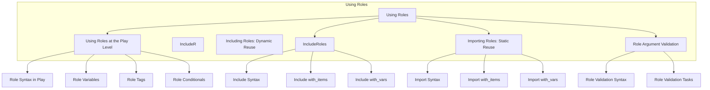
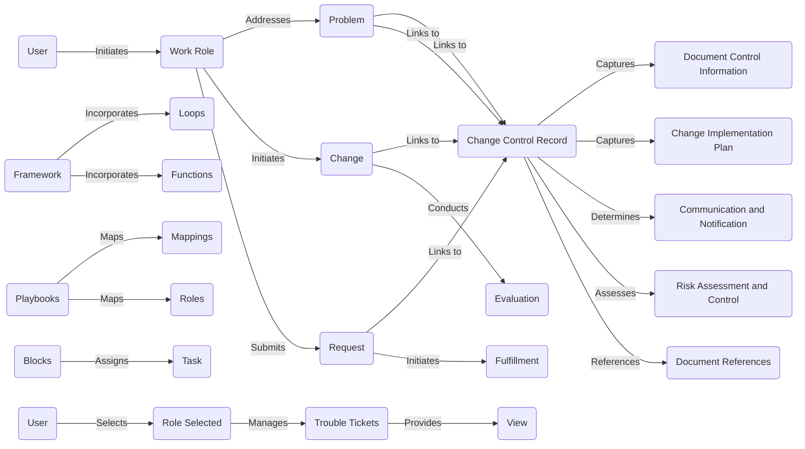

# Roles

Roles

User (A)
Work Role (B)
Problem (C)
Change (D)
Request (E)
Change Control Record (F)
Document Control Information (G)
Change Implementation Plan (H)
Communication and Notification (I)
Risk Assessment and Control (J)
Document References (K)
Evaluation (L)
Fulfillment (M)
Framework (N)
Loops (O)
Functions (P)
Playbooks (Q)
Mappings (R)
Roles (S)
Blocks (T)
Task (U)
User (V)
Role Selected (W)
Trouble Tickets (X)
View (Y)

