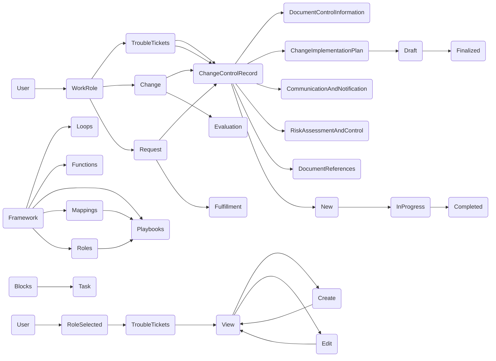

```mermaid
graph LR
    A(User) --> B(WorkRole)
    B --> C(Problem)
    B --> D(Change)
    B --> E(Request)
    C --> F(ChangeControlRecord)
    D --> F
    E --> F
    F --> G(DocumentControlInformation)
    F --> H(ChangeImplementationPlan)
    F --> I(CommunicationAndNotification)
    F --> J(RiskAssessmentAndControl)
    F --> K(DocumentReferences)
    C(TroubleTickets) --> F
    D --> L(Evaluation)
    E --> M(Fulfillment)
    N(Framework) --> O(Loops)
    N --> P(Functions)
    N --> Q(Playbooks)
    N --> R(Mappings)
    N --> S(Roles)
    R --> Q
    S --> Q
    T(Blocks) --> U(Task)
    V(User) --> W(RoleSelected)
    W --> X(TroubleTickets)
    X --> Y(View)
    Y --> Z(Create)
    Y --> AA(Edit)
    AA --> Y
    Z --> Y
    F(ChangeControlRecord) --> AB(New)
    AB --> AC(InProgress)
    AC --> AD(Completed)
    H(ChangeImplementationPlan) --> AE(Draft)
    AE --> AF(Finalized)
```
